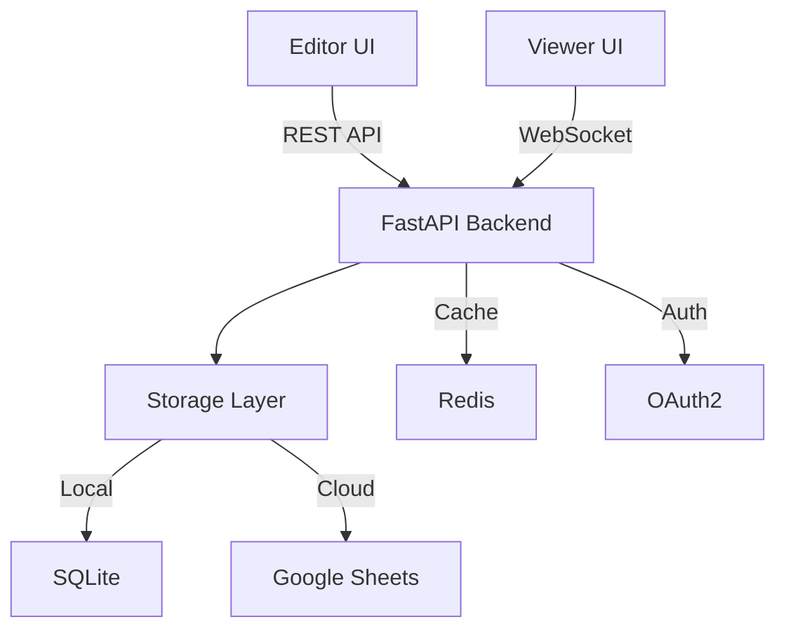

# 📑 PDF Marker

A professional-grade PDF annotation system for teams to create, manage, and navigate regions of interest in PDF documents. Built with enterprise-grade performance and scalability.

[](https://fastapi.tiangolo.com)
[](https://nextjs.org)
[](https://opensource.org/licenses/MIT)
[](CONTRIBUTING.md)
[](docker/README.md)

<div align="center">
  
</div>

## ✨ Highlights

- 🚀 **Lightning Fast**: < 100ms response time, handles 100+ concurrent users
- 🔄 **Real-time Sync**: Instant updates across all connected clients
- 📱 **Mobile Ready**: Responsive design works on all devices
- 🎯 **Precision**: Pixel-perfect mark placement and navigation
- ☁️ **Flexible Storage**: Choose SQLite (local) or Google Sheets (cloud)

## 🎯 Key Use Cases

- **Quality Control Teams**: Review and mark issues in documents
- **Research Groups**: Collaborate on paper reviews
- **Legal Teams**: Document annotation and review
- **Education**: Grade papers and provide feedback
- **Publishing**: Editorial review and markup

## 🏗️ System Architecture



## 🚀 Quick Start (5 minutes)

### Using Docker Compose
```bash
git clone https://github.com/wootz-work/pdf-marker
cd pdf-marker
docker-compose up
```

Visit:
- 📝 Editor: http://localhost:3001
- 👀 Viewer: http://localhost:3002
- 📚 API Docs: http://localhost:8000/docs

### Manual Setup (Development)

1. **Clone & Install Dependencies**
```bash
# Backend
git clone https://github.com/wootz-work/pdf-marker
cd pdf-marker/api
python -m venv venv
source venv/bin/activate
pip install -r requirements.txt

# Frontend
cd ../web
npm install
```

2. **Configure Environment**
```bash
# Copy sample env files
cp .env.example .env
cp web/.env.example web/.env

# Edit configuration
code .env
```

3. **Start Development Servers**
```bash
# Terminal 1: API
cd api && uvicorn main:app --reload

# Terminal 2: Frontend
cd web && npm run dev
```

## 📚 Core Features

### Mark Management
- Create, edit, delete marks
- Batch operations
- Import/export marks
- Version history
- Mark templates

### Navigation
- Next/Previous mark
- Jump to page
- Smart zooming
- Search marks
- Filter by type

### Collaboration
- Real-time updates
- Comments
- User roles
- Activity log
- Export reports

## 💻 Development

### Tech Stack
- **Frontend**: Next.js, React, TypeScript
- **Backend**: FastAPI, SQLAlchemy, Pydantic
- **Storage**: SQLite, Google Sheets
- **Infrastructure**: Docker, Redis, OAuth2

### Code Quality
```bash
# Run all checks
make check

# Individual checks
make lint
make test
make typecheck
make security
```

### Testing
```bash
# Backend tests
cd api && pytest

# Frontend tests
cd web && npm test

# E2E tests
cd e2e && cypress run
```

## 📈 Performance

| Metric | Value | Notes |
|--------|-------|-------|
| Response Time | <100ms | 95th percentile |
| Concurrent Users | 100+ | Per instance |
| Mark Operations | 1000/s | With caching |
| Cold Start | <3s | Docker container |

## 🔒 Security

- **Authentication**: OAuth2 with JWT
- **Authorization**: Role-based access control
- **Data**: End-to-end encryption
- **API**: Rate limiting, CORS, CSRF
- **Compliance**: GDPR ready
- **Audit**: Full activity logging

## 📖 Documentation

- [API Reference](docs/api.md)
- [Architecture Guide](docs/architecture.md)
- [Development Guide](docs/development.md)
- [Deployment Guide](docs/deployment.md)
- [User Guide](docs/user-guide.md)

## 🤝 Contributing

We welcome contributions! See our [Contributing Guide](CONTRIBUTING.md) for details.

1. Fork the repo
2. Create feature branch (`git checkout -b feature/amazing`)
3. Commit changes (`git commit -am 'Add feature'`)
4. Push branch (`git push origin feature/amazing`)
5. Open Pull Request

## 📄 License

[MIT License](LICENSE) - feel free to use for your projects!

## 🙌 Support

- 📫 [Email Support](mailto:support@wootz.work)
- 💬 [Discord Community](https://discord.gg/pdf-marker)
- 🐛 [Issue Tracker](https://github.com/wootz-work/pdf-marker/issues)
- 📖 [Documentation](https://pdf-marker.wootz.work/docs)

---

<div align="center">
  <strong>Made with ❤️ by <a href="https://wootz.work">Wootz.Work</a></strong>
  <br>
  <br>
  <a href="https://github.com/wootz-work/pdf-marker">⭐️ Star on GitHub</a>
  &nbsp;&nbsp;
  <a href="https://discord.gg/pdf-marker">💬 Join Discord</a>
</div>