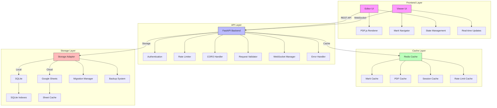

<div align="center">

# 📑 PDF Marker

A professional-grade PDF annotation system for managing and navigating regions of interest in PDF documents. 
Built for high performance, scalability, and precision workflows, PDF Marker is designed to enhance productivity and collaboration in various fields, including education, legal, and publishing.

[](https://fastapi.tiangolo.com)
[](https://nextjs.org)
[](https://www.python.org/downloads/)
[](https://opensource.org/licenses/MIT)
[](tests/)
[](docker/)
[](CONTRIBUTING.md)

<p align="center">
  <a href="#key-features">Key Features</a> •
  <a href="#architecture">Architecture</a> •
  <a href="#quick-start">Quick Start</a> •
  <a href="#documentation">Documentation</a> •
  <a href="#contributing">Contributing</a>
</p>

</div>

## ✨ Key Features

### Core Capabilities
- 🎯 **Precise Mark Management**: Create, edit, and delete rectangular marks on PDF documents with pixel-perfect accuracy.
- 🔄 **Dual Storage Support**: Choose between SQLite for local development and Google Sheets for cloud-based storage, allowing flexibility based on your needs.
- 📱 **Responsive Design**: Optimized for both desktop and mobile devices, ensuring a seamless user experience across platforms.
- 🚀 **High-Performance Architecture**: Built with performance in mind, utilizing intelligent caching and optimized data handling to ensure fast response times.
- 🔒 **Enterprise-Grade Security**: Comprehensive authentication and authorization mechanisms to protect sensitive data and ensure secure access.

### Technical Highlights
- 📈 **Sub-100ms Response Times**: Core operations are optimized for speed, providing a smooth user experience.
- 🔄 **Real-Time Synchronization**: Changes made by one user are instantly reflected for all connected clients, enhancing collaboration.
- 💾 **Efficient Delta-Based Storage Updates**: Only changes are stored, minimizing data transfer and storage requirements.
- 🎚️ **Configurable Caching Strategies**: Adjust caching settings to optimize performance based on specific use cases.
- 📊 **Built-In Performance Monitoring**: Track application performance metrics to identify bottlenecks and optimize resource usage.

## 🏗️ Architecture



### Architecture Components

#### Frontend Layer
- **Editor UI**: Advanced mark creation and editing interface that allows users to annotate PDFs intuitively.
- **Viewer UI**: Efficient mark navigation and viewing interface designed for quick access to annotations.
- **PDF.js Renderer**: High-performance PDF document rendering engine that supports various PDF features.
- **Mark Navigator**: Intuitive navigation controls for jumping between marks and sections of the document.
- **State Management**: Redux-based state handling for predictable state transitions and easier debugging.
- **Real-time Updates**: WebSocket-based synchronization to ensure all users see the latest changes instantly.

#### API Layer
- **FastAPI Backend**: High-performance asynchronous API server that handles requests efficiently.
- **Authentication**: JWT-based authentication system that secures user sessions and data.
- **Rate Limiter**: Advanced request throttling to prevent abuse and ensure fair usage.
- **CORS Handler**: Configurable cross-origin resource sharing settings to control access from different domains.
- **Request Validator**: Comprehensive input validation to protect against malformed requests.
- **WebSocket Manager**: Handles real-time communication between clients and the server.
- **Error Handler**: Graceful error management to provide meaningful feedback to users.

#### Cache Layer
- **Redis Cache**: Distributed caching system that speeds up data retrieval and reduces load on the database.
- **Mark Cache**: Frequently accessed mark data stored for quick retrieval.
- **PDF Cache**: Rendered PDF pages and metadata cached to improve loading times.
- **Session Cache**: User session management to maintain state across requests.
- **Rate Limit Cache**: Stores request counts to enforce rate limiting.

#### Storage Layer
- **Storage Adapter**: Pluggable storage interface that allows easy switching between different storage backends.
- **SQLite**: Local development database that is lightweight and easy to set up.
- **Google Sheets**: Cloud-based production storage that allows for easy collaboration and sharing.
- **Migration Manager**: Manages database schema changes and migrations.
- **Backup System**: Automated backup handling to ensure data safety.

## 🚀 Quick Start

### Prerequisites
To get started with PDF Marker, ensure you have the following software installed:
```bash
# Required software
Python 3.8+
Node.js 16+
Redis Server
Google Cloud Account (for Sheets backend)
```

### Development Setup

1. **Clone & Configure Backend**
```bash
# Clone repository
git clone https://github.com/aniketsandhanwootz-wq/PDF-Markbook.git
cd pdf-marker

# Create virtual environment
python -m venv venv
source venv/bin/activate  # On Windows: venv\Scripts\activate

# Install dependencies
pip install -r requirements.txt
pip install -r requirements-dev.txt

# Setup environment
cp .env.example .env
```

2. **Configure Frontend**
```bash
# Navigate to frontend directory
cd frontend

# Install dependencies
npm install

# Setup environment
cp .env.example .env.local
```

3. **Start Development Servers**
```bash
# Terminal 1: Start API Server
uvicorn main:app --reload --port 8000

# Terminal 2: Start Frontend
npm run dev

# Terminal 3: Start Redis Server
redis-server
```

### Using Docker
For a containerized setup, you can use Docker:
```bash
# Build and run all services
docker-compose up -d

# View logs
docker-compose logs -f
```

## 📚 Documentation

### API Documentation
- [Authentication](docs/api/auth.md): Learn how to authenticate users and manage sessions.
- [Mark Management](docs/api/marks.md): Detailed API endpoints for creating, updating, and deleting marks.
- [Error Handling](docs/api/errors.md): Understand how errors are managed and reported.
- [WebSocket API](docs/api/websocket.md): Real-time communication endpoints.

### Development Guides
- [Architecture Overview](docs/architecture.md): In-depth look at the system architecture.
- [Development Setup](docs/development.md): Step-by-step guide for setting up the development environment.
- [Testing Guide](docs/testing.md): Instructions for running tests and ensuring code quality.
- [Contributing Guide](CONTRIBUTING.md): Guidelines for contributing to the project.

### Deployment
- [Production Setup](docs/deployment/production.md): Best practices for deploying to production.
- [Docker Deployment](docs/deployment/docker.md): Instructions for deploying using Docker.
- [Cloud Deployment](docs/deployment/cloud.md): Guide for deploying to cloud platforms.

## 🔧 Development

### Running Tests
To ensure the quality of the code, run the following tests:
```bash
# Run test suites
make test              # All tests
make test-unit        # Unit tests only
make test-integration # Integration tests
make test-e2e        # End-to-end tests

# Generate coverage report
make coverage
```

### Code Quality
Maintain code quality with the following commands:
```bash
# Run all checks
make check

# Individual checks
make lint
make typecheck
make format
```

## 📊 Performance Metrics

| Operation | Average | P95 | P99 |
|-----------|---------|-----|-----|
| Read Mark | 45ms | 65ms | 85ms |
| Create Mark | 85ms | 120ms | 150ms |
| Update Mark | 75ms | 110ms | 140ms |
| List Marks | 150ms | 200ms | 250ms |
| PDF Load | 200ms | 350ms | 500ms |

## 🔒 Security Features

### Authentication & Authorization
- **JWT-based Authentication**: Secure user sessions with JSON Web Tokens.
- **Role-Based Access Control**: Manage user permissions based on roles.
- **Session Management**: Track user sessions and enforce security policies.
- **Password Hashing**: Use Argon2 for secure password storage.

### API Security
- **Rate Limiting**: Prevent abuse by limiting the number of requests.
- **Input Validation**: Ensure all inputs are validated to prevent attacks.
- **SQL Injection Prevention**: Use parameterized queries to protect against SQL injection.
- **XSS Protection**: Sanitize user inputs to prevent cross-site scripting.
- **CSRF Tokens**: Protect against cross-site request forgery attacks.

### Data Security
- **Encrypted Storage**: Store sensitive data securely.
- **Secure Communication**: Use HTTPS for all communications.
- **Audit Logging**: Maintain logs of all actions for security audits.
- **Regular Security Updates**: Keep dependencies and libraries up to date.

## 🛠️ Configuration

### Environment Variables

| Variable | Required | Default | Description |
|----------|----------|---------|-------------|
| `STORAGE_BACKEND` | Yes | `sqlite` | Storage backend (sqlite/sheets) |
| `DATABASE_URL` | If SQLite | `sqlite:///./marks.db` | Database connection |
| `GOOGLE_SA_JSON` | If Sheets | - | Service account path |
| `REDIS_URL` | Yes | `redis://localhost` | Redis connection |
| `JWT_SECRET` | Yes | - | JWT signing key |
| `CORS_ORIGINS` | No | `*` | Allowed origins |
| `LOG_LEVEL` | No | `INFO` | Logging level |
| `PORT` | No | 8000 | API server port |

## 🤝 Contributing

We welcome contributions! Please see our [Contributing Guide](CONTRIBUTING.md) for details.

### Development Workflow
1. **Fork the Repository**: Create your own copy of the repository.
2. **Create a Feature Branch**: Use `git checkout -b feature/amazing` to create a new branch.
3. **Make Changes and Test**: Implement your feature and run tests to ensure everything works.
4. **Run Code Quality Checks**: Ensure your code meets quality standards.
5. **Commit Changes**: Use `git commit -am 'Add amazing feature'` to commit your changes.
6. **Push Branch**: Push your branch to your forked repository.
7. **Open a Pull Request**: Submit your changes for review.

## 📝 License

MIT License - See [LICENSE](LICENSE) for details

---

<div align="center">
  <strong>Built for precision document workflows</strong>
  <br>
  Made with ❤️ by <a href="https://wootz.work">Wootz.Work</a>
  <br>
  <br>
  <a href="https://github.com/aniketsandhanwootz-wq/PDF-Markbook.git">⭐️ Star on GitHub</a>
</div>