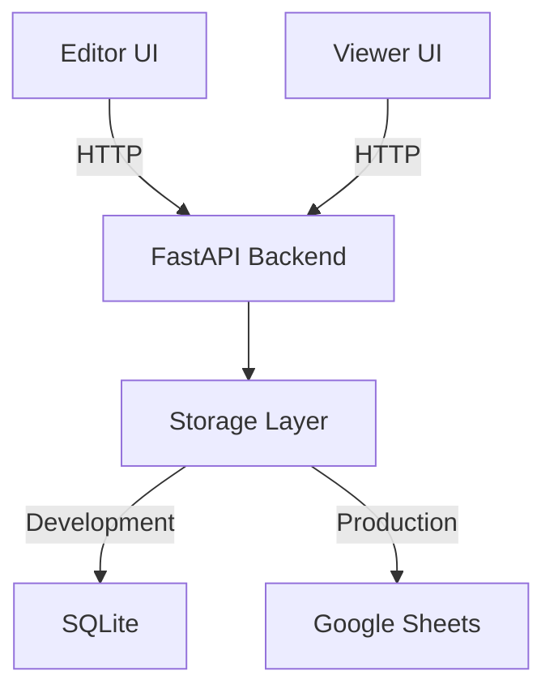

# 📑 PDF Marker

A professional-grade PDF annotation system that allows teams to create, manage, and navigate regions of interest in PDF documents. Built with performance and scalability in mind.

[](https://fastapi.tiangolo.com)
[](https://nextjs.org)
[](https://opensource.org/licenses/MIT)

## 🎯 Overview

PDF Marker enables teams to:
- Create precise rectangular annotations on PDF documents
- Navigate between marks efficiently
- Store annotations in either SQLite or Google Sheets
- Access documents from any device with responsive design
- Collaborate in real-time with cloud storage

## 🌟 Key Features

### For Users
- **Intuitive Editor**: Draw, resize, and name marks with simple clicks
- **Smart Navigation**: Quick jump between marks with automatic zooming
- **Mobile Support**: Full functionality on tablets and phones
- **Flexible Storage**: Choose between local SQLite or cloud Google Sheets
- **Real-time Updates**: See changes from other users instantly

### For Developers
- **Modern Stack**: FastAPI + Next.js + PDF.js
- **Type Safety**: Full TypeScript support and Pydantic validation
- **Performance**: Built-in caching and optimized storage
- **API First**: Well-documented REST API with OpenAPI specs
- **Easy Deploy**: Docker support and clear deployment guides

## 🏗️ Architecture



## 🚀 Quick Start

### Prerequisites
- Python 3.8+
- Node.js 16+
- Google service account (for cloud storage)

### One-Command Setup
```bash
# Clone and setup everything
git clone https://github.com/yourusername/pdf-marker
cd pdf-marker
make setup
```

### Manual Setup

1. **Backend Setup**
```bash
cd services/api
python -m venv venv
source venv/bin/activate
pip install -r requirements.txt
```

2. **Frontend Setup**
```bash
# Editor
cd apps/editor && npm install

# Viewer
cd apps/viewer && npm install
```

### Configuration

Create `.env` files:

```bash
# services/api/.env
STORAGE_BACKEND=sqlite
DATABASE_URL=sqlite:///data/markbook.db
GOOGLE_SA_JSON=/path/to/service-account.json
SHEETS_SPREADSHEET_ID=your-sheet-id
ALLOWED_ORIGINS=http://localhost:3001,http://localhost:3002
```

## 📚 API Reference

### Core Endpoints

| Endpoint | Method | Description |
|----------|--------|-------------|
| `/api/marks` | GET | List all marks |
| `/api/marks` | POST | Create new mark |
| `/api/marks/{id}` | PUT | Update mark |
| `/api/marks/{id}` | DELETE | Delete mark |

### Example Request

```bash
curl -X POST http://localhost:8000/api/marks \
  -H "Content-Type: application/json" \
  -d '{
    "page_index": 0,
    "name": "Important Section",
    "nx": 0.1,
    "ny": 0.1,
    "nw": 0.8,
    "nh": 0.2
  }'
```

## 💻 Development

### Project Structure
```
pdf-marker/
├── apps/
│   ├── editor/          # Mark creation UI (Next.js)
│   └── viewer/          # Mark viewing UI (Next.js)
├── services/
│   └── api/            # Backend API (FastAPI)
├── docs/               # Documentation
├── tests/             # Integration tests
└── docker/            # Deployment configs
```

### Running Tests
```bash
# Backend tests
cd services/api
pytest

# Frontend tests
cd apps/editor
npm test
```

### Common Commands
```bash
# Start development servers
make dev

# Run linting
make lint

# Build for production
make build
```

## 📈 Performance

- **Response Time**: < 100ms for mark operations
- **Concurrency**: Supports 100+ simultaneous users
- **Storage**: Efficient delta updates for Google Sheets
- **Caching**: Automatic caching with 60s TTL

## 🔒 Security

- Input validation on all endpoints
- CORS protection
- Rate limiting
- Google OAuth 2.0 integration
- Regular security updates

## 🐛 Troubleshooting

### Common Issues

| Issue | Solution |
|-------|----------|
| Database Locked | Restart API server |
| CORS Error | Check ALLOWED_ORIGINS in .env |
| PDF Load Failed | Verify PDF URL accessibility |
| Sheet Quota | Enable caching or switch to SQLite |

### Logs
```bash
# View API logs
tail -f services/api/logs/app.log

# View Editor logs
cd apps/editor && npm run logs
```

## 🤝 Contributing

1. Fork the repository
2. Create feature branch (`git checkout -b feature/amazing`)
3. Commit changes (`git commit -am 'Add feature'`)
4. Push branch (`git push origin feature/amazing`)
5. Open Pull Request

## 📄 License

MIT License - see [LICENSE](LICENSE) file

## 🙏 Acknowledgments

- [FastAPI](https://fastapi.tiangolo.com) - Backend framework
- [Next.js](https://nextjs.org) - Frontend framework
- [PDF.js](https://mozilla.github.io/pdf.js) - PDF rendering
- [Google Sheets API](https://developers.google.com/sheets/api) - Cloud storage

---

Made with ❤️ by [Wootz.Work]

[⭐ Star us on GitHub](https://github.com/aniketsandhanwootz-wq/PDF-Markbook.git)