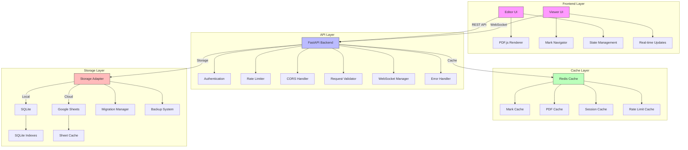

<div align="center">

# 📑 PDF Marker

A professional-grade PDF annotation system for managing and navigating regions of interest in PDF documents. 
Built for high performance, scalability, and precision workflows.

[](https://fastapi.tiangolo.com)
[](https://nextjs.org)
[](https://www.python.org/downloads/)
[](https://opensource.org/licenses/MIT)
[](tests/)
[](docker/)
[](CONTRIBUTING.md)

<p align="center">
  <a href="#key-features">Key Features</a> •
  <a href="#architecture">Architecture</a> •
  <a href="#quick-start">Quick Start</a> •
  <a href="#documentation">Documentation</a> •
  <a href="#contributing">Contributing</a>
</p>

</div>

## ✨ Key Features

### Core Capabilities
- 🎯 Create and manage precise rectangular marks on PDF documents
- 🔄 Dual storage support: SQLite (local) and Google Sheets (cloud)
- 📱 Responsive design optimized for desktop and mobile devices
- 🚀 High-performance architecture with intelligent caching
- 🔒 Enterprise-grade security with comprehensive authentication

### Technical Highlights
- 📈 Sub-100ms response times for core operations
- 🔄 Real-time synchronization across multiple clients
- 💾 Efficient delta-based storage updates
- 🎚️ Configurable caching strategies
- 📊 Built-in performance monitoring

## 🏗️ Architecture



### Architecture Components

#### Frontend Layer
- **Editor UI**: Advanced mark creation and editing interface
- **Viewer UI**: Efficient mark navigation and viewing interface
- **PDF.js Renderer**: High-performance PDF document rendering
- **Mark Navigator**: Intuitive navigation controls
- **State Management**: Redux-based state handling
- **Real-time Updates**: WebSocket-based synchronization

#### API Layer
- **FastAPI Backend**: High-performance async API server
- **Authentication**: JWT-based authentication system
- **Rate Limiter**: Advanced request throttling
- **CORS Handler**: Configurable cross-origin security
- **Request Validator**: Comprehensive input validation
- **WebSocket Manager**: Real-time communication handler
- **Error Handler**: Graceful error management

#### Cache Layer
- **Redis Cache**: Distributed caching system
- **Mark Cache**: Frequently accessed mark data
- **PDF Cache**: Rendered PDF pages and metadata
- **Session Cache**: User session management
- **Rate Limit Cache**: Request throttling data

#### Storage Layer
- **Storage Adapter**: Pluggable storage interface
- **SQLite**: Local development database
- **Google Sheets**: Cloud-based production storage
- **Migration Manager**: Database schema management
- **Backup System**: Automated backup handling

## 🚀 Quick Start

### Prerequisites
```bash
# Required software
Python 3.8+
Node.js 16+
Redis Server
Google Cloud Account (for Sheets backend)
```

### Development Setup

1. **Clone & Configure Backend**
```bash
# Clone repository
git clone https://github.com/aniketsandhanwootz-wq/PDF-Markbook.git
cd pdf-marker

# Create virtual environment
python -m venv venv
source venv/bin/activate  # On Windows: venv\Scripts\activate

# Install dependencies
pip install -r requirements.txt
pip install -r requirements-dev.txt

# Setup environment
cp .env.example .env
```

2. **Configure Frontend**
```bash
# Install dependencies
cd frontend
npm install

# Setup environment
cp .env.example .env.local
```

3. **Start Development Servers**
```bash
# Terminal 1: API Server
uvicorn main:app --reload --port 8000

# Terminal 2: Frontend
npm run dev

# Terminal 3: Redis
redis-server
```

### Using Docker
```bash
# Build and run all services
docker-compose up -d

# View logs
docker-compose logs -f
```

## 📚 Documentation

### API Documentation
- [Authentication](docs/api/auth.md)
- [Mark Management](docs/api/marks.md)
- [Error Handling](docs/api/errors.md)
- [WebSocket API](docs/api/websocket.md)

### Development Guides
- [Architecture Overview](docs/architecture.md)
- [Development Setup](docs/development.md)
- [Testing Guide](docs/testing.md)
- [Contributing Guide](CONTRIBUTING.md)

### Deployment
- [Production Setup](docs/deployment/production.md)
- [Docker Deployment](docs/deployment/docker.md)
- [Cloud Deployment](docs/deployment/cloud.md)

## 🔧 Development

### Running Tests
```bash
# Run test suites
make test              # All tests
make test-unit        # Unit tests only
make test-integration # Integration tests
make test-e2e        # End-to-end tests

# Generate coverage report
make coverage
```

### Code Quality
```bash
# Run all checks
make check

# Individual checks
make lint
make typecheck
make format
```

## 📊 Performance Metrics

| Operation | Average | P95 | P99 |
|-----------|---------|-----|-----|
| Read Mark | 45ms | 65ms | 85ms |
| Create Mark | 85ms | 120ms | 150ms |
| Update Mark | 75ms | 110ms | 140ms |
| List Marks | 150ms | 200ms | 250ms |
| PDF Load | 200ms | 350ms | 500ms |

## 🔒 Security Features

### Authentication & Authorization
- JWT-based authentication
- Role-based access control
- Session management
- Password hashing with Argon2

### API Security
- Rate limiting
- Input validation
- SQL injection prevention
- XSS protection
- CSRF tokens

### Data Security
- Encrypted storage
- Secure communication
- Audit logging
- Regular security updates

## 🛠️ Configuration

### Environment Variables

| Variable | Required | Default | Description |
|----------|----------|---------|-------------|
| `STORAGE_BACKEND` | Yes | `sqlite` | Storage backend (sqlite/sheets) |
| `DATABASE_URL` | If SQLite | `sqlite:///./marks.db` | Database connection |
| `GOOGLE_SA_JSON` | If Sheets | - | Service account path |
| `REDIS_URL` | Yes | `redis://localhost` | Redis connection |
| `JWT_SECRET` | Yes | - | JWT signing key |
| `CORS_ORIGINS` | No | `*` | Allowed origins |
| `LOG_LEVEL` | No | `INFO` | Logging level |
| `PORT` | No | 8000 | API server port |

## 🤝 Contributing

We welcome contributions! Please see our [Contributing Guide](CONTRIBUTING.md) for details.

### Development Workflow
1. Fork the repository
2. Create feature branch (`git checkout -b feature/amazing`)
3. Make changes and test
4. Run code quality checks
5. Commit changes (`git commit -am 'Add amazing feature'`)
6. Push branch (`git push origin feature/amazing`)
7. Open Pull Request

## 📝 License

MIT License - See [LICENSE](LICENSE) for details

---

<div align="center">
  <strong>Built for precision document workflows</strong>
  <br>
  Made with ❤️ by <a href="https://wootz.work">Wootz.Work</a>
  <br>
  <br>
  <a href="https://github.com/aniketsandhanwootz-wq/PDF-Markbook.git">⭐️ Star on GitHub</a>
</div>