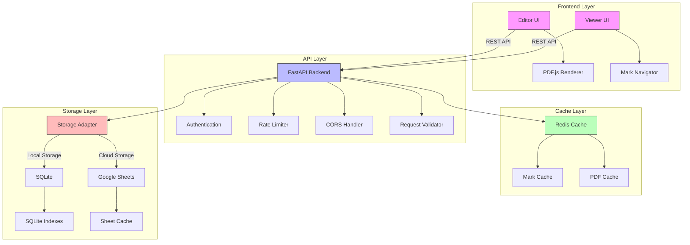

# 📑 PDF Marker

A robust PDF annotation system for managing and navigating regions of interest in PDF documents. Built for high performance and scalability.

[](https://fastapi.tiangolo.com)
[](https://nextjs.org)
[](https://www.python.org/downloads/)
[](https://opensource.org/licenses/MIT)
[](tests/)

## ✨ Key Features

- 🎯 Create and manage precise rectangular marks on PDF documents
- 🔄 Support for both SQLite (local) and Google Sheets (cloud) storage
- 📱 Responsive design for desktop and mobile devices
- 🚀 High performance with caching and optimized storage
- 🔒 Comprehensive security with authentication and authorization

## 🏗️ Architecture



### Architecture Components

#### Frontend Layer
- **Editor UI**: Mark creation and editing interface
- **Viewer UI**: Mark navigation and viewing interface
- **PDF.js Renderer**: PDF document rendering engine
- **Mark Navigator**: Navigation controls for marks

#### API Layer
- **FastAPI Backend**: Core API server
- **Authentication**: JWT-based auth system
- **Rate Limiter**: Request throttling
- **CORS Handler**: Cross-origin security
- **Request Validator**: Input validation

#### Cache Layer
- **Redis Cache**: In-memory caching system
- **Mark Cache**: Frequently accessed marks
- **PDF Cache**: Rendered PDF pages

#### Storage Layer
- **Storage Adapter**: Abstract storage interface
- **SQLite**: Local development storage
- **Google Sheets**: Production cloud storage
- **Indexes**: Performance optimizations
- **Sheet Cache**: Google API call reduction


## 🚀 Quick Start

### Prerequisites
- Python 3.8+
- Node.js 16+
- Google service account (for Sheets backend)

### Installation

1. **Clone & Setup Backend**
```bash
git clone https://github.com/yourusername/pdf-marker
cd pdf-marker

python -m venv venv
source venv/bin/activate  # On Windows: venv\Scripts\activate
pip install -r requirements.txt
```

2. **Configure Environment**
```bash
# Create .env file
cp .env.example .env

# Add required settings
STORAGE_BACKEND=sqlite  # or sheets
DATABASE_URL=sqlite:///./marks.db
GOOGLE_SA_JSON=/path/to/service-account.json  # If using sheets
```

3. **Run Development Servers**
```bash
# Start API (Terminal 1)
uvicorn main:app --reload --port 8000

# Start Frontend (Terminal 2)
cd frontend
npm install
npm run dev
```

Access:
- Editor: http://localhost:3001
- Viewer: http://localhost:3002
- API Docs: http://localhost:8000/docs

## 💻 Development

### Project Structure
```
pdf-marker/
├── api/
│   ├── main.py           # FastAPI application
│   ├── models/           # Data models
│   └── storage/          # Storage backends
├── frontend/
│   ├── editor/          # Mark creation UI
│   └── viewer/          # Mark viewing UI
└── tests/              # Test suites
```

### API Endpoints

```bash
# Mark Management
GET    /api/marks       # List marks
POST   /api/marks       # Create mark
PUT    /api/marks/{id}  # Update mark
DELETE /api/marks/{id}  # Delete mark

# Utilities
GET    /api/health     # Health check
GET    /api/metrics    # Performance metrics
```

### Running Tests
```bash
# Run all tests
pytest

# Run with coverage
pytest --cov=api tests/
```

## 📊 Performance

| Operation | Response Time |
|-----------|--------------|
| Read Mark | <50ms |
| Create Mark | <100ms |
| Update Mark | <100ms |
| List Marks | <200ms |

## 🔒 Security

- Input validation on all endpoints
- SQL injection prevention
- XSS protection
- Rate limiting
- CORS configuration
- Request validation

## 🛠️ Configuration Options

### Environment Variables

| Variable | Required | Default | Description |
|----------|----------|---------|-------------|
| `STORAGE_BACKEND` | Yes | `sqlite` | Storage backend (sqlite/sheets) |
| `DATABASE_URL` | If SQLite | `sqlite:///./marks.db` | Database connection |
| `GOOGLE_SA_JSON` | If Sheets | - | Service account path |
| `PORT` | No | 8000 | API server port |

## 🤝 Contributing

1. Fork the repository
2. Create feature branch (`git checkout -b feature/xyz`)
3. Make changes and test
4. Commit changes (`git commit -am 'Add xyz'`)
5. Push branch (`git push origin feature/xyz`)
6. Create Pull Request

## 📝 License

MIT License - See [LICENSE](LICENSE) for details

---

<div align="center">
  <strong>Built for precision document workflows</strong>
  <br>
  Made with ❤️ by <a href="https://wootz.work">Wootz.Work</a>
  <br>
  <br>
  <a href="https://github.com/yourusername/pdf-marker">⭐️ Star on GitHub</a>
</div>